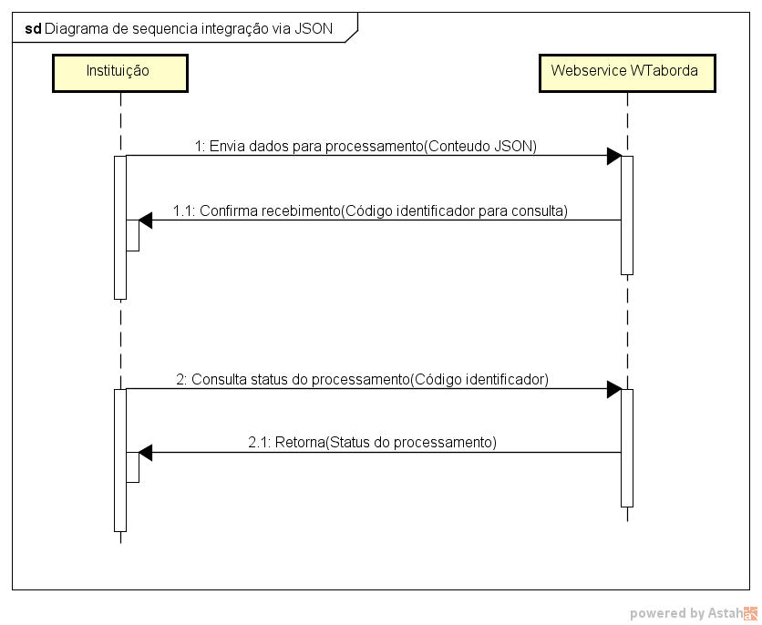
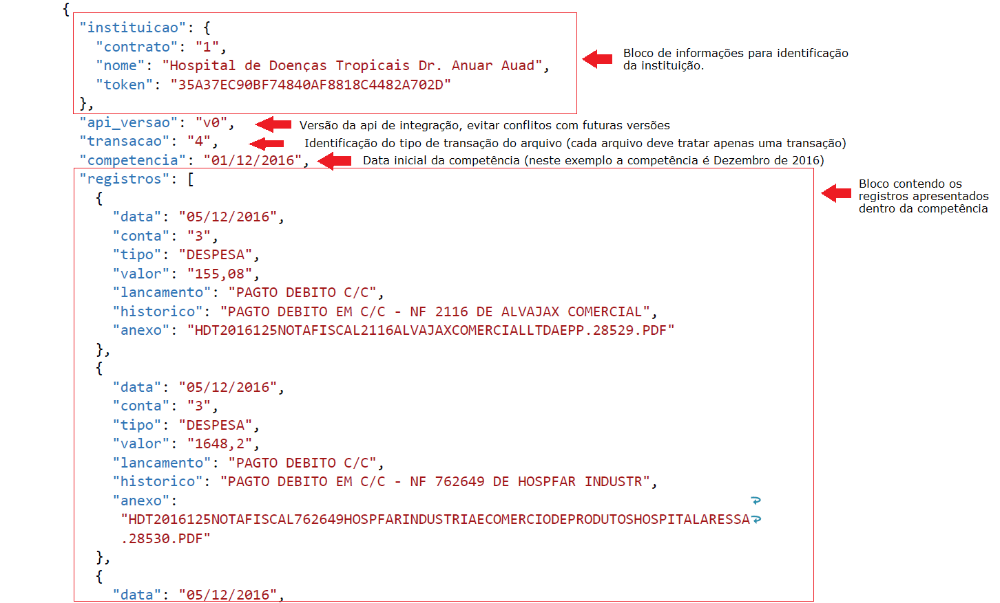

# Integração JSON

Material de apoio para a documentação do processo de integração com o sistema WTaborda via envio de documentos online no formato [JSON](https://pt.wikipedia.org/wiki/JSON).

## Diagrama de sequencia

## Geração dos arquivos JSON

Modelo inicial de arquivo JSON (Transação 4)

